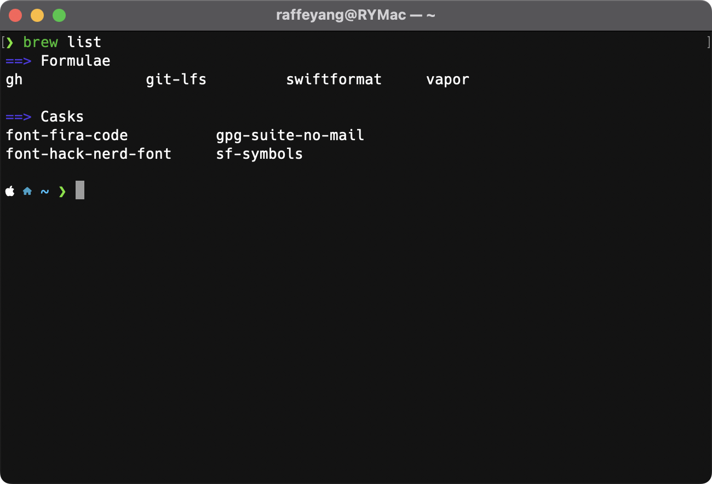
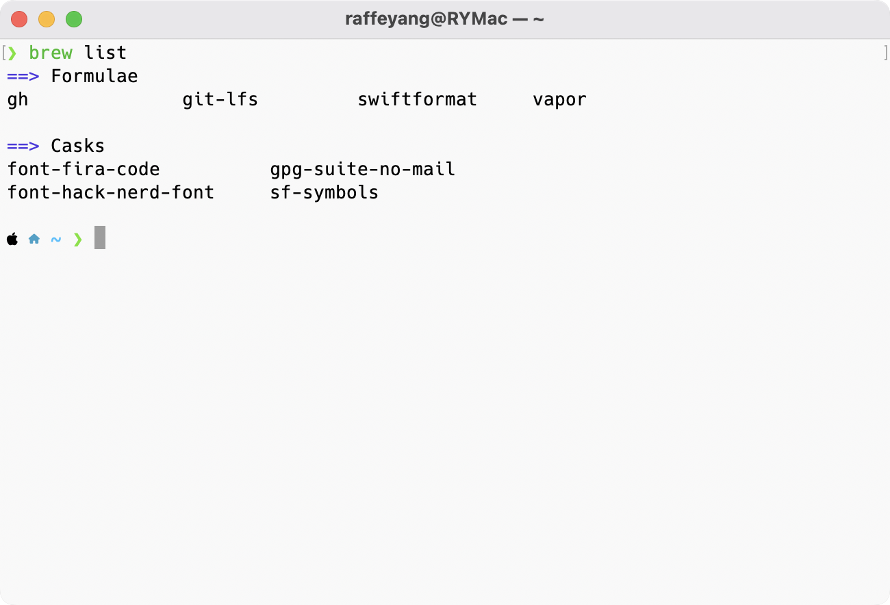
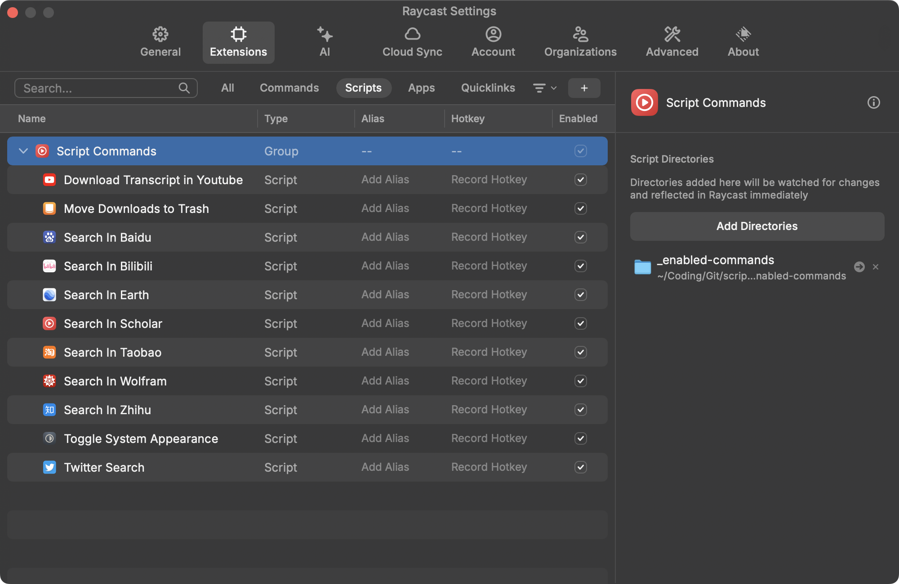

# Switch Terminal Profile Theme

Automatically switch macOS Terminal themes based on the system appearance mode (dark or light). This project provides an efficient solution for users who want their Terminal to adapt to macOS's appearance mode dynamically, enhancing consistency across the system's visual style.




## How to Use

Automatic Theme Switching: Seamlessly switch Terminal themes based on macOS appearance mode (light or dark).
User-Friendly: Easy setup with minimal configuration needed.
Customizable: Supports any Terminal profile that matches your system's light or dark theme preferences.
Installation

1. Clone the Repository:

```bash
git clone git@github.com:raffeyang/SwitchTerminalProfileTheme.git
cd SwitchTerminalProfileTheme
```
2. Script Setup: 
Copy `SwitchTerminalProfile.applescript` to a suitable directory, like `~/.bin`:

```bash
cp SwitchTerminalProfile.applescript ~/.bin/SwitchTerminalProfile.applescript
```

Add the following line to your `.zshrc` or `.bashrc` file:
```bash
# Initialize Terminal Theme
~/.bin/Initialize\ Terminal.sh
```

3.Raycast Integration (Optional):
Use an application like Raycast to run AppleScript.
Add Toggle System Appearance.applescript to Raycast for easy toggling of the macOS appearance mode.



Run Toggle System Appearance in Raycast: This will manually switch your macOS theme, and Terminal will adapt accordingly.
Usage

Automatic Theme Switching: Launch Terminal to automatically set the profile based on the macOS appearance mode.
Manual Toggle: You can toggle the system appearance using the Toggle System Appearance script in Raycast to see the Terminal theme change immediately.
How It Works

The SwitchTerminalProfile.applescript detects macOS's current appearance setting (dark or light mode) and applies the corresponding Terminal profile. The Initialize Terminal.sh script ensures this setting is applied whenever the Terminal is launched.

## Contribution

Contributions are welcome! Feel free to submit pull requests or open issues to improve this script.

Let me know if you need further adjustments!